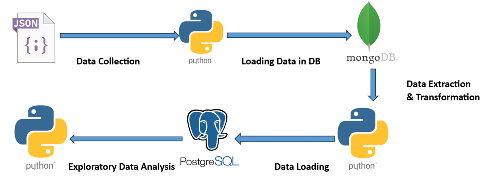
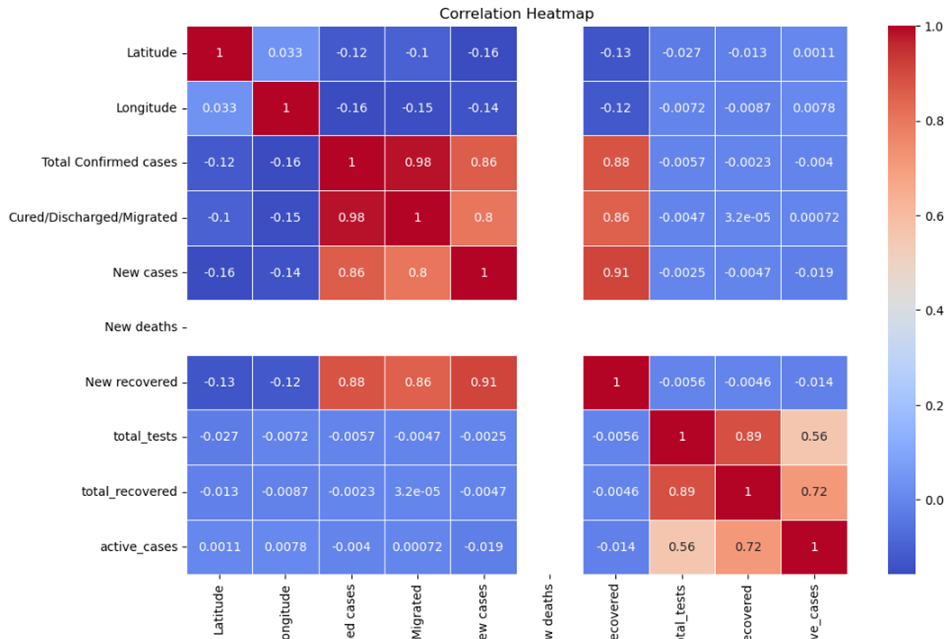
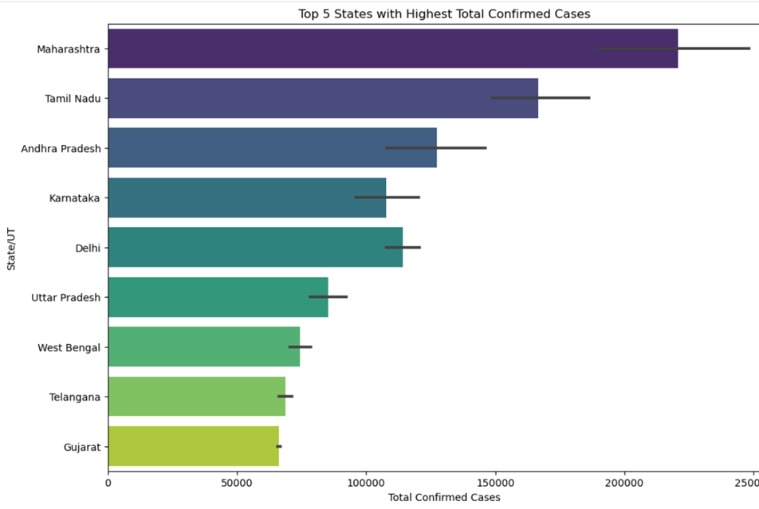
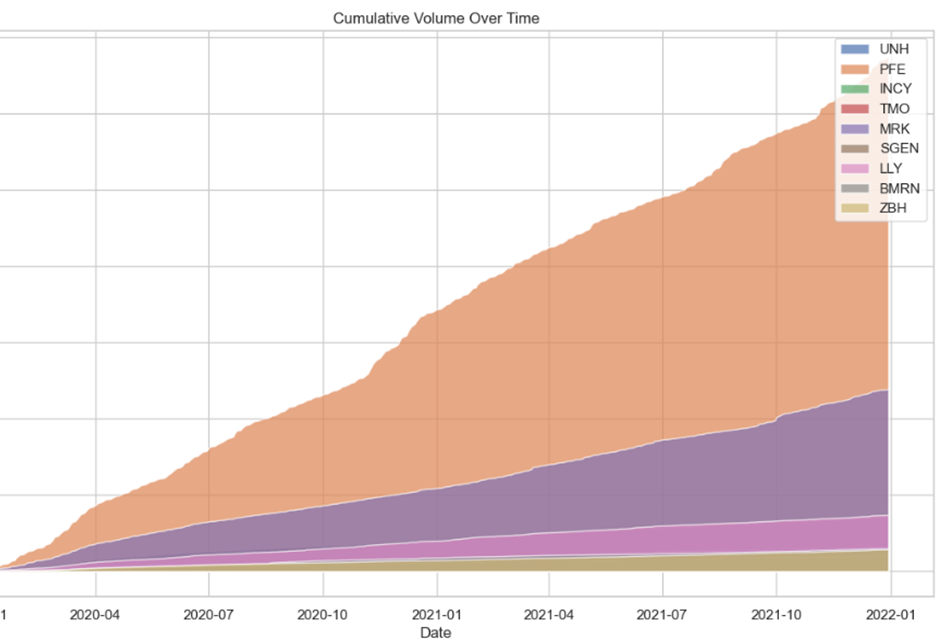
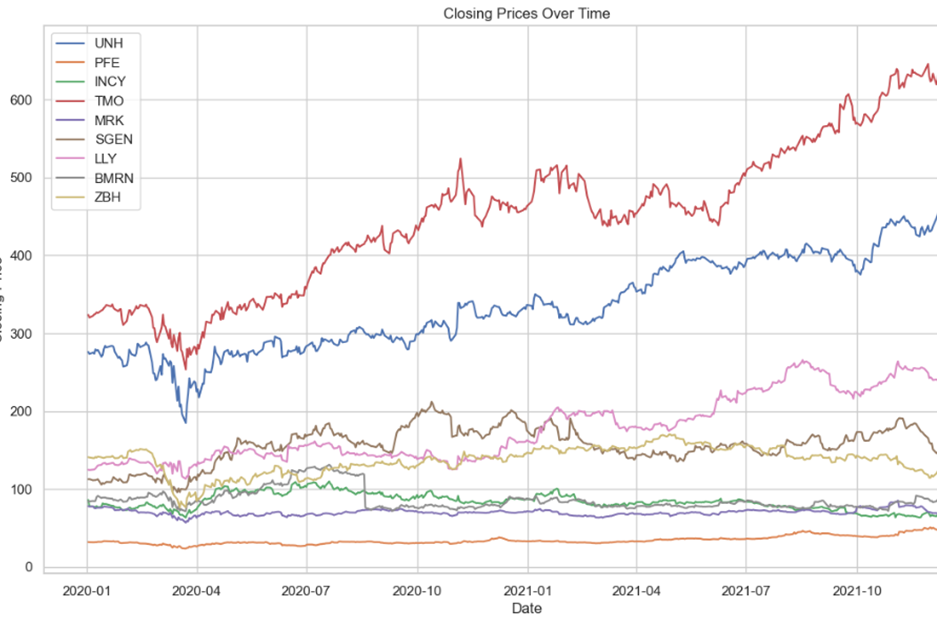
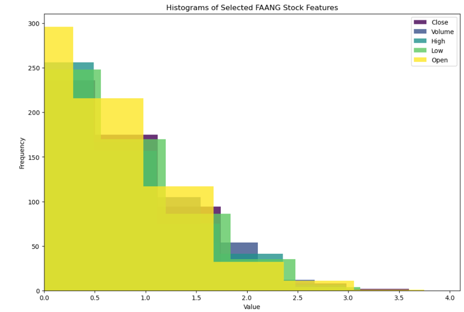
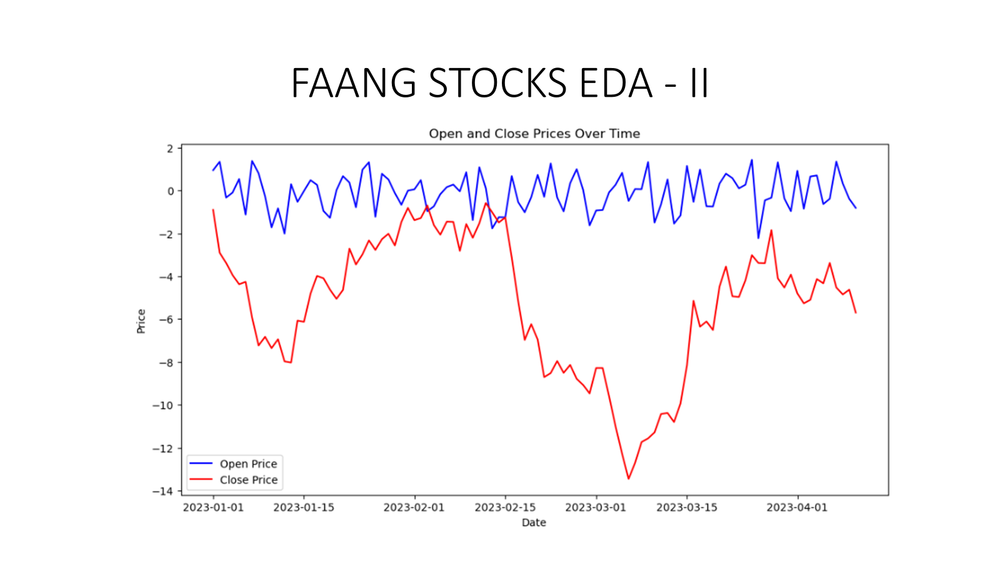

# Database & Analytics Programming Project

### The COVID-19 pandemic has directly impacted global stock markets due to worldwide lockdowns, quarantines, production interruptions, and reduced investment. This led to widespread economic disruptions, resulting in significant volatility and declines in stock markets globally. The project aims to conduct Exploratory Data Analysis on the effects of the pandemic on stock prices within two sectors: Information Technology and Health & Pharmaceutical industry.

## System Design

## COVID Data EDA

## Health Stocks Data EDA

## IT Stocks Data EDA

